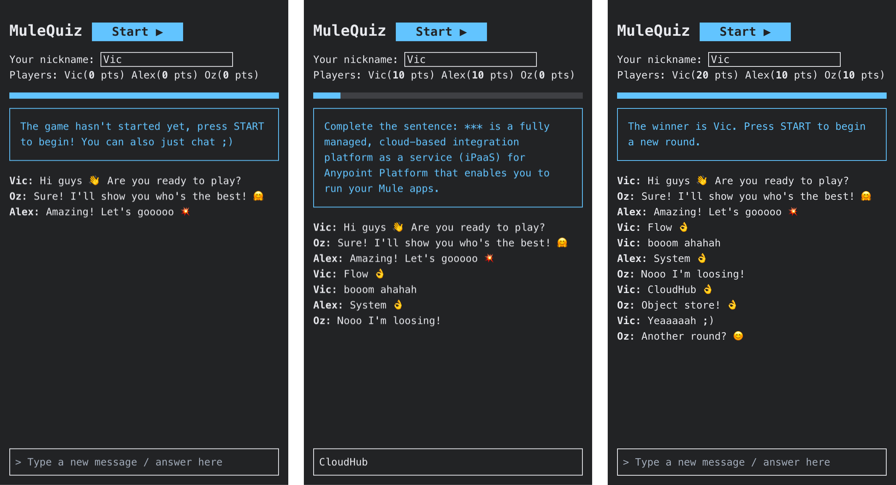

# MuleQuiz

MuleQuiz allows you to play with your friends / colleagues and improve your knowledge about MuleSoft.  
This project is deployed on CloudHub and could be tested via this url: https://api.victorbahl.com/mquiz/

## Screenshots

## Local Installation / Usage

### Pre-requisites
- Anypoint Studio 7.5 or higher

### Steps
- Download this repository
- Open Anypoint Studio and import the mulequiz project (from File System)
- Rename `common-config-template.yaml` to `common-config.yaml`
- Update the keystore settings and put your `keystore.jks` in `other/` folder
    - Step-by-step process is available [here](https://docs.mulesoft.com/mule-runtime/4.3/build-an-https-service#build-an-https-service)
- Run the project
- Go on https://localhost/

> Note: In order to get Chrome to accept self-signed localhost certificate: 
> Simply paste this in your chrome: `chrome://flags/#allow-insecure-localhost` and click Enable.

### Optional steps

In order to have your own dynamic questions, you must:
- Create a database and a quiz table (script available in `other/quiz.sql`)
- Set the dynamicQuestions in `common-config.yaml` setting to true
- Set the DB settings (and the DB connector if you aren't using PostgreSQL)

## Contributing
Pull requests are welcome. For major changes, please open an issue first to discuss what you would like to change.

## License
[Apache 2.0](https://www.apache.org/licenses/LICENSE-2.0)